<h1 align="center">glean</h1>

<p align="center">
  <em>Self-hosted, pluggable personal agent that gleans signal from RSS, scraping, search, and APIs — processes it with any LLM, then delivers on a schedule to whatever sink you wire up.</em>
</p>

<p align="center">
  
</p>

<p align="center">
  <a href="https://github.com/jaypetez/glean/actions/workflows/ci.yml"></a>
  <a href="https://github.com/jaypetez/glean/actions/workflows/codeql.yml"></a>
  <a href="./LICENSE"></a>
  <a href="https://www.python.org/downloads/"></a>
  <a href="https://github.com/jaypetez/glean/pkgs/container/glean"></a>
  <a href="https://github.com/jaypetez/glean/discussions"></a>
</p>

`glean` is a small Python daemon that runs as a Docker container. You describe **feeds** in a YAML file — each one is a recipe of `sources → LLM pipeline → sink → schedule`. It deduplicates, ranks, summarizes, and posts a clean digest. One container, many topics, many sinks.

## Status

**v0.1** — early. Today's shipped sink is Telegram; the architecture is sink-agnostic and more sinks (email, webhook, Slack, Discord, file) are roadmap. See [DESIGN.md](./DESIGN.md) for the long view.

## Why

The use case that started it: drop the agent in your "AI news" Telegram group, and once an hour it posts a tight 10-item digest summarized by your local Ollama. Add a second feed for security CVEs that runs daily and uses Claude. Add a third for `r/LocalLLaMA` top-of-day. The agent doesn't care what the topic is — sources, prompts, models, sinks are all config.

The longer game: any "periodically pull X, process with an LLM, deliver to Y" workflow — research clipping, deal scraping, job monitoring, GitHub release tracking, on-call digests — should be a few lines of YAML, not a custom script.

## Features

- **Pluggable sources** — RSS/Atom, web scraping, Hacker News, Reddit, web search (Brave / Tavily / SearXNG). Add your own in one file.
- **Pluggable LLM** — Ollama (default), Anthropic, OpenAI. Per-feed provider/model: local for the noisy feed, Claude for the important one.
- **Per-feed pipeline** — declare stages in YAML: `dedup → rank → summarize → digest`. Reorder freely. Skip stages you don't want.
- **Smart dedup** — SQLite-backed, persists across restarts. New feed? Indexed silently on first tick — no surprise 200-item dump.
- **Friendly schedules** — `every 1h`, `every 15m`, `daily 09:00`, or raw cron.
- **Failure-aware** — exponential backoff in-tick, ops-chat alert after N consecutive failures, auto-clear on recovery.
- **One container** — `docker compose up`. Ollama is bundled in the compose file; bring your own if you prefer.

## Quickstart (5 minutes)

```bash
git clone https://github.com/jaypetez/glean.git
cd glean

# 1. Get a Telegram bot token from @BotFather, add the bot to a group, get the chat id
#    (one easy way: send a message in the group then visit
#     https://api.telegram.org/bot<TOKEN>/getUpdates )

# 2. Configure
cp .env.example .env                 # fill in TELEGRAM_BOT_TOKEN + chat IDs
cp feeds.example.yaml feeds.yaml     # tweak feeds, prompts, schedules

# 3. Run
docker compose up -d

# 4. Pull an Ollama model the first time
docker exec -it glean-ollama ollama pull qwen2.5:7b

# 5. Sanity-check a feed without sending
docker exec -it glean glean test-feed ai-news-daily
```

## Configuration

Two files, two responsibilities:

- **`.env`** — secrets (bot tokens, API keys, chat IDs). Never committed.
- **`feeds.yaml`** — feeds, sources, prompts, schedules. Safe to commit. References `${ENV_VARS}`.

See [`feeds.example.yaml`](./feeds.example.yaml) for a working starter with four feeds.

### Minimum feed

```yaml
defaults:
  llm:
    provider: ollama
    model: qwen2.5:7b
    base_url: http://ollama:11434

feeds:
  - name: ai-news-daily
    schedule: "every 1h"
    chat_id: ${TELEGRAM_CHAT_AI}
    sources:
      - type: rss
        url: https://simonwillison.net/atom/everything/
    pipeline:
      - dedup
      - summarize:
          prompt: "One-sentence summary."
      - digest:
          intro: "🧠 <b>AI news this hour</b>"
```

### Source types

| Type      | Args                                                            |
|-----------|-----------------------------------------------------------------|
| `rss`     | `url`                                                           |
| `scraper` | `urls: [list of article URLs]`                                  |
| `hn`      | `query`, `tags` (default `story`), `min_points`, `window_hours` |
| `reddit`  | `subreddit`, `sort` (`top`/`new`/`hot`), `timeframe`, `limit`   |
| `search`  | `query`, `engine` (`brave`/`tavily`/`searxng`), `limit`         |

### Pipeline stages

| Stage       | Effect                                                       |
|-------------|--------------------------------------------------------------|
| `dedup`     | Drop already-seen items (by canonical URL hash).             |
| `rank`      | LLM scores each item; drops below `min_relevance` (0..1).    |
| `summarize` | LLM writes a 1-line summary, attached to each item.          |
| `digest`    | Sets the digest header. Optionally LLM-synthesized.          |

Send goes implicitly at the end.

### Schedules

| String              | Meaning                                |
|---------------------|----------------------------------------|
| `every 30s`         | Every 30 seconds                       |
| `every 15m`         | Every 15 minutes                       |
| `every 1h`          | Every hour                             |
| `daily 09:00`       | Every day at 09:00 (`$TZ`)             |
| `@hourly`, `@daily` | Cron presets                           |
| `0 */2 * * *`       | Any 5-field cron expression            |

## CLI

```
glean run                       # daemon; container entrypoint
glean test-feed <name>          # dry-run; prints would-be message
glean test-feed <name> --send   # like above but actually sends
glean send-now <name>           # immediate run, send for real
glean list-feeds                # feeds + last-run state
glean validate-config           # exit 0/1; prints errors
glean version
```

All commands accept `--config <path>` (default `/etc/glean/feeds.yaml`) and `--db <path>` (default `/data/state.db`).

## Operating notes

- **Bootstrap is silent.** First run of any new feed indexes current items into the seen-set without sending — only genuinely-new items go out next tick. Override with `bootstrap: send-last-N` if you want a primer.
- **State lives at `/data/state.db`.** Mount a volume. SQLite, inspectable with the `sqlite3` CLI.
- **Health endpoint:** `GET /healthz` on port 9090 (loopback only by default).
- **Logs:** structured key=value to stderr in dev, JSON when `LOG_FORMAT=json`.
- **Telegram rate limits:** the sender retries on `RetryAfter` automatically.
- **LLM failures during ranking:** items with failed scores are dropped (treated as `0.0`). Summarize failures fall back to the source-provided summary.

## Roadmap

- More sinks: email (SMTP), webhook (POST any URL), Slack, Discord, file/append-only log.
- A `Sink` protocol so `telegram/` becomes the first plugin under `sinks/`, not a special case.
- Inbound Telegram (and other) commands — `/pause <feed>`, `/run <feed>` from the chat itself.
- Embedding-based semantic dedup ("we already covered this story 2 days ago").
- Per-feed prompt versioning + A/B testing.

## Adding a new source plugin

A source is a class implementing `Source` (`fetch(ctx) -> list[Item]`) and decorated with `@register_source("yourtype")`. See `src/glean/sources/rss.py` for the smallest example, and [`docs/plugins.md`](./docs/plugins.md) for the full author's guide.

## Adding a new LLM provider

An LLM provider implements `rank` / `summarize` / `digest` and is registered with `@register_provider("yourname")`. See `src/glean/llm/ollama_provider.py`.

## Development

```bash
uv venv
uv pip install -e ".[dev]"
ruff check src tests
mypy src
pytest -q
```

## Contributing

Issues and PRs welcome. For non-trivial changes please open an issue first to align on direction. See [`docs/plugins.md`](./docs/plugins.md) for how to add sources / LLM providers (and eventually sinks).

## License

[MIT](./LICENSE).
