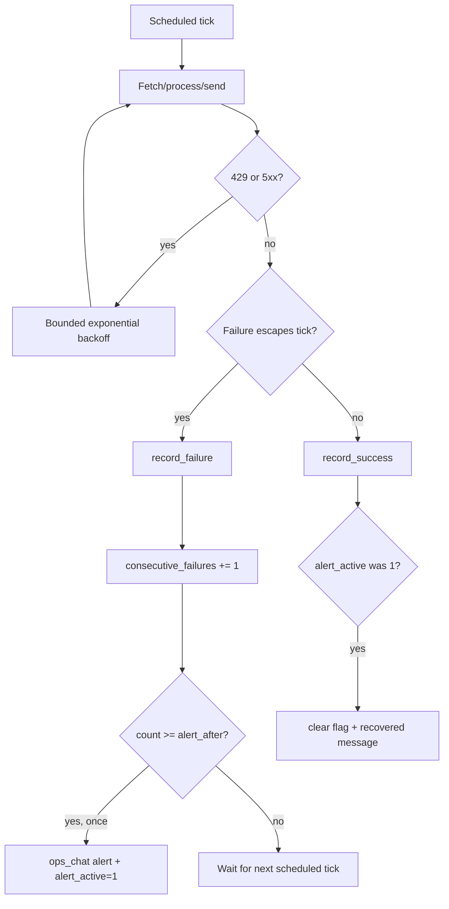

# Failure model

glean separates transient retry behavior inside one tick from persistent failure tracking across ticks.

*Who reads this: operators who need to reason about alerts, retries, and recovery.*

*This page is Explanation — read it to understand the model. For task-focused steps, see the [How-to guides](../how-to/index.md).*

A feed runs on a schedule. Each scheduled run is a tick: fetch sources, process items, render, send, and record the outcome. The failure model exists because not all failures mean the same thing. A model API returning one 429 may be a short burst. A feed failing three scheduled runs in a row is an operational condition.

Inside a tick, transient HTTP and LLM failures such as 429s and 5xxs are retried with bounded exponential backoff. This protects against brief rate limits, connection hiccups, and overloaded model endpoints without involving the scheduler. The run is still one tick; it simply spends part of that tick waiting and trying again.

When a failure escapes the tick, glean records it in SQLite. The feed's `consecutive_failures` count increments. If that count reaches `failure.alert_after`, which defaults to 3, glean sends one alert to `ops_chat_id` and sets `alert_active=1`. The flag matters because it prevents a noisy feed from posting the same alert every tick after the threshold. The problem remains active, but the alert has already been raised.

There are **no retries between ticks**. The next scheduled run is the retry. This is a deliberate boundary: the scheduler owns time, while the pipeline owns one attempt. If a feed is scheduled every hour and an outage lasts two hours, the hourly ticks are the cross-tick retry cadence.

A later successful run calls `record_success`. If `alert_active` was set, success clears the flag and returns a recovery signal. glean then posts a recovered message to the ops chat. The pair of messages tells a story: persistent failure began, and normal operation resumed.

This model keeps transient noise local, persistent problems visible, and recovery explicit.
