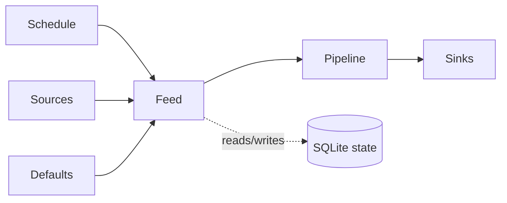

# What is a feed?

The unit of work in glean. A feed bundles sources, a pipeline, sinks, and a schedule into one named digest.

*Who reads this: operators and contributors who want the mental model behind `feeds.yaml`.*

*This page is Explanation — read it to understand the model. For task-focused steps, see the [How-to guides](../how-to/index.md).*

A feed is the thing glean runs. It is not a source, not a Telegram channel, and not a prompt. It is the whole recipe: where items come from, how they are processed, where the result goes, and when the recipe should run again.

A useful analogy is a recurring editorial desk. The sources are reporters dropping raw notes on the desk. The pipeline is the editor's workflow: remove repeats, decide what matters, summarize, shape the digest. The sinks are the places the edited brief is published. The schedule says when the desk opens.

The feed itself should be thought of as stateless across runs. A run starts, fetches current items, processes them, sends a digest, and exits. Memory about what happened before lives in SQLite, not inside the feed object. That state includes seen item hashes, run success and failure counters, bootstrap status, and HTTP cache metadata such as ETags. This separation is why a container restart does not make every old RSS entry look new again: SQLite remembers; the feed merely asks.

Feeds also sit on top of defaults. The top-level `defaults:` block describes shared choices such as the default LLM, render settings, sinks, bootstrap mode, and failure behavior. Each `FeedConfig` can override those fields, and runtime code reads the merged view through methods such as `feed.effective_llm(defaults)`, `feed.effective_render(defaults)`, `feed.effective_sinks(defaults)`, `feed.effective_bootstrap(defaults)`, and `feed.effective_failure(defaults)`. The effective value is the contract the runner uses.

That merge model keeps large configurations boring. A dozen feeds can share the same Telegram token, render style, and Ollama model, while one security feed overrides the LLM and one archival feed overrides the sinks. The feed remains the boundary for operational questions: what ran, what failed, what was sent, and what should happen on the next tick.
