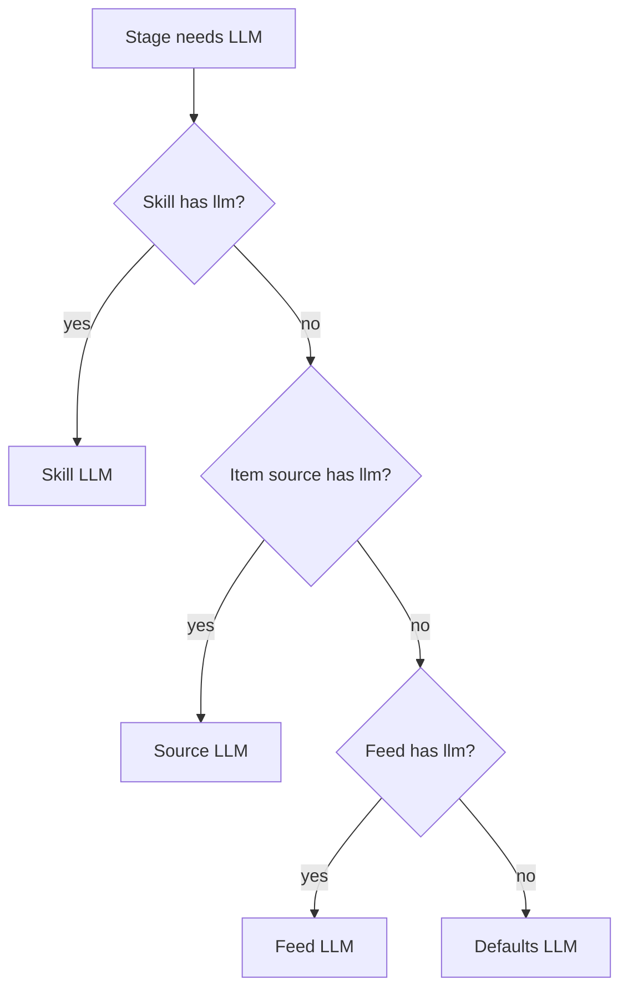

# LLM dispatch and precedence

LLM dispatch is the precedence chain that chooses the model used for ranking, summaries, digests, and skills.

*Who reads this: users balancing digest quality, privacy, latency, and model cost.*

*This page is Explanation — read it to understand the model. For task-focused steps, see the [How-to guides](../how-to/index.md).*

A feed can have more than one kind of intelligence requirement. Noisy RSS firehoses need cheap filtering. A curated subreddit may justify a better summary model. A security extraction skill may need the most reliable structured output. LLM dispatch exists so those choices can coexist inside one feed instead of forcing every item through the same model.

The precedence chain is **Skill LLM > Source LLM > Feed LLM > Defaults LLM**.

The defaults LLM is the baseline. It represents the ordinary model for the instance, often a local Ollama model. It is useful when most feeds are low-cost, private, or good enough with the same model.

The feed LLM overrides that baseline for one named feed. It is the right level when the whole topic has a different quality bar. A daily security feed, for example, might use a paid model because every item needs accurate severity and impact language. An entertainment feed might stay local.

The source LLM overrides the feed for items from a specific source. This is where cost optimization becomes precise. A noisy HN RSS query can use a cheap local model for ranking because many items will be dropped. A curated `r/LocalLLaMA` source in the same feed can use a premium model because fewer items arrive and the summaries matter more. The digest remains one feed even though item-level processing differs by source.

The skill LLM overrides everything else for `apply_skill`. It belongs to the extraction template rather than the source, because some schemas are inherently more demanding. A `cve-extractor` skill may require strong structured output even when the source's normal summaries use a cheaper model.

The digest stage is slightly different: LLM-generated digest intros use the feed's default resolved provider, not each individual source provider, because the header summarizes the batch as a whole. Item-level stages such as rank, summarize, and apply_skill can dispatch per item.

The model is designed for explicit trade-offs: local for privacy and cost, premium for high-value curation, source overrides for mixed-signal feeds, and skill overrides for schema reliability.
