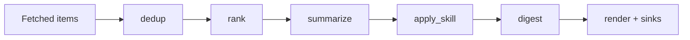

# How the pipeline works

The pipeline is the ordered set of stages that turns fetched items into a digest.

*Who reads this: users tuning digest quality and contributors changing stage behavior.*

*This page is Explanation — read it to understand the model. For task-focused steps, see the [How-to guides](../how-to/index.md).*

A feed gathers items, but the pipeline decides what those items become. In YAML, the pipeline is a list of stages. The common mental model is `dedup → rank → summarize → apply_skill → digest`, but the list is intentionally reorderable. glean treats the pipeline like an assembly line whose stations can be rearranged when the editorial trade-off changes.

`dedup` exists because feeds are noisy. Sources repeat, mirrors publish the same URL, and RSS feeds often keep old entries near the top. glean performs state-backed dedup before the YAML stages, then the `dedup` stage removes duplicates within the current batch. The first protects against past runs; the second protects against overlap inside one run.

`rank` exists because not every new item deserves attention. It asks the selected LLM for a score from 0 to 1 and drops items below `min_relevance`. Ranking is a filter and an ordering mechanism: kept items are sorted by score so the highest-signal entries reach the top of the digest.

`summarize` exists because source text is rarely digest-shaped. It attaches an `llm_summary` to each item without mutating the original item; pipeline code creates new `Item` instances with the added field. This preserves the source payload while giving renderers a concise line to show.

`apply_skill` exists for structured extraction. Instead of asking for prose, a named skill asks the LLM to fill an output schema, such as CVE severity, deal price, or paper contribution. The result lands on `Item.structured`, and common fields such as `summary`, `one_liner`, or `tldr` can also populate `llm_summary`.

`digest` exists to shape the header and framing. With an `intro`, it is static. With a prompt, the feed LLM can synthesize a short header from the selected items.

Reordering changes meaning. Summarizing before ranking costs more LLM calls but may improve recall because ranking sees distilled summaries. Applying a skill before digest lets the final message reflect structured fields. The pipeline is therefore not just plumbing; it is the editorial policy of the feed.
