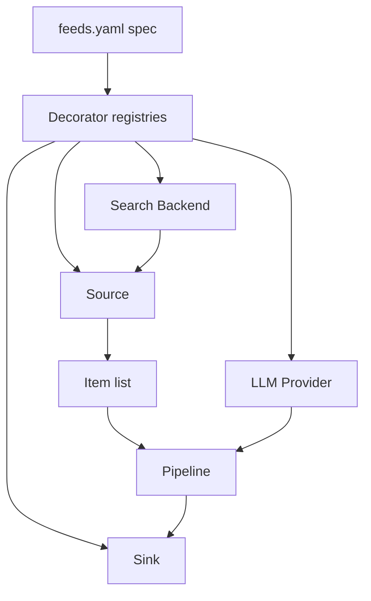

# Plugin layers

glean is extended through four small registry-backed plugin layers: Source, Sink, LLM Provider, and Search Backend.

*Who reads this: contributors and advanced users who want to understand how integrations fit together.*

*This page is Explanation — read it to understand the model. For task-focused steps, see the [How-to guides](../how-to/index.md).*

The plugin system exists so glean can stay small while the world around it changes. New content sources, delivery targets, model APIs, and search engines should not require a new pipeline architecture. They should require one narrow adapter that speaks the relevant protocol.

There are four layers. A **Source** fetches external material and returns a list of `Item` objects. A **Sink** receives rendered digest output and sends or stores it somewhere. An **LLM Provider** implements ranking, summarization, digest generation, structured extraction, and cleanup. A **Search Backend** is the engine behind the `search` source; it turns a query into result items through systems such as SearXNG, Brave, Tavily, Serper, Exa, or MWMBL.

All four layers use the same pattern. A plugin class implements a protocol, decorates itself with a registry decorator such as `@register_source("rss")`, and is imported by the registry's module-level `_import_builtins()` function. The import is deliberately boring: its purpose is to trigger the decorator side effect so the registry knows that the type exists.

That registry shape gives YAML a stable vocabulary. When a feed says `type: rss`, the source registry looks up the registered class for `rss`. When a sink says `type: file`, the sink registry builds the file sink. The same idea applies to provider names and search engine names.

The important consequence is that constructor keyword arguments become the user-facing API. Registry builders pass the YAML spec to the plugin constructor after removing the identifying key such as `type` or `provider`. If a source constructor accepts `url`, then `url:` is a valid YAML field. If a sink constructor accepts `required=False`, that option can appear in `feeds.yaml`.

This keeps documentation and implementation close. The protocol defines what the runtime expects. The constructor defines what users can configure. The registry maps a short YAML name to that implementation. Adding capability means adding an adapter at the correct layer, not teaching every feed how that adapter works.
