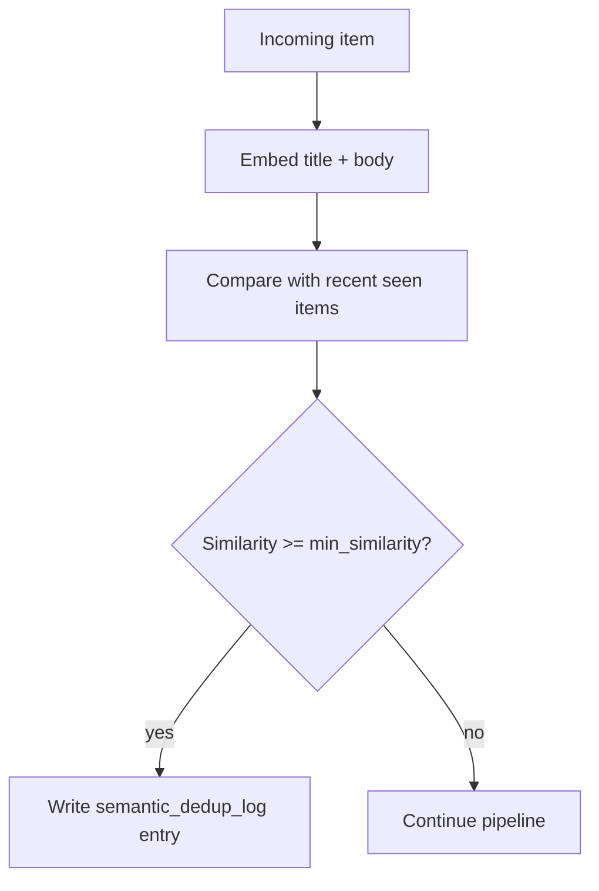

# Semantic dedup

Semantic dedup is the pipeline stage that suppresses near-duplicate items even when the URLs are different.

*Who reads this: users who want to reduce repetitive digests or understand why an item was skipped.*

*This page is Explanation — read it to understand the model. For task-focused steps, see the [How-to guides](../how-to/index.md).*

Ordinary dedup only catches exact matches such as the same canonical URL or the same fallback content hash. That works well for reposts, but it misses the common case where several sources cover the same story with different URLs and slightly different wording. Semantic dedup compares embeddings instead, so glean can recognize that those items are effectively the same topic.

At runtime, the `semantic_dedup` stage asks the configured embedding provider for vectors, compares each incoming item against recently seen items for the same feed, and suppresses the item when the highest similarity is at or above the configured threshold. Suppressed items are not sent downstream to digest rendering or sinks.

Each suppression record stores the suppressed item's URL and title, the matched prior item's URL and title, the similarity score, and the trace id for correlation. The Feed Detail UI exposes these records in the **Suppressed** tab so operators can inspect why something was filtered.

Use semantic dedup when many sources cover the same topic and you would rather see one good item than five nearly identical summaries. Keep the threshold high when false positives are expensive, and lower it carefully when you want aggressive clustering of repetitive news.
