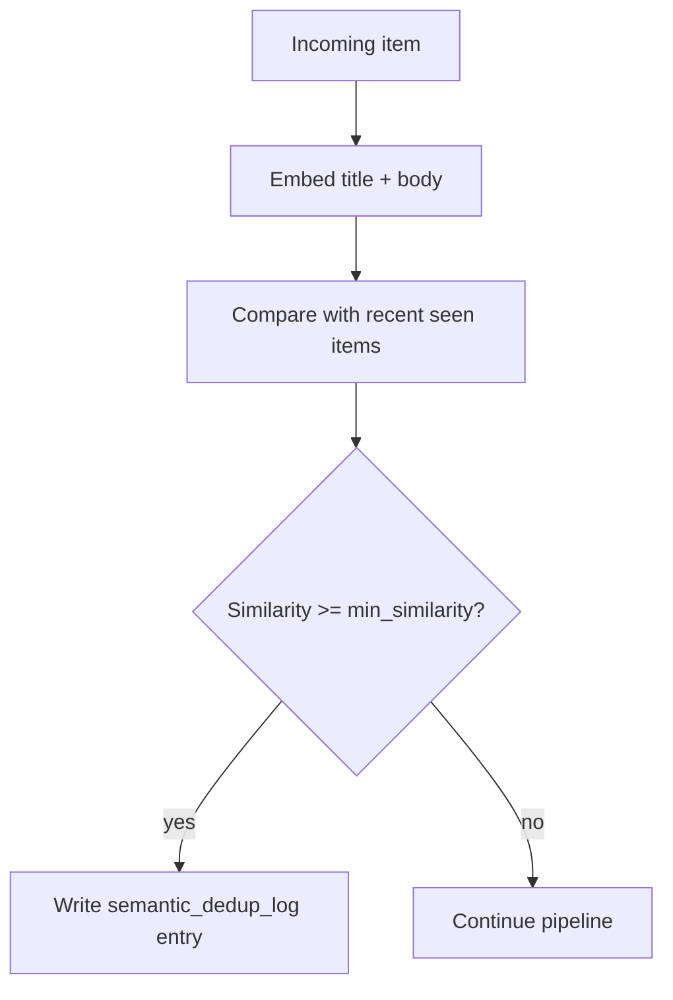

# Semantic dedup

Semantic dedup is the opt-in pipeline stage that suppresses near-duplicate items even when the URLs are different.

*Who reads this: users who want to reduce repetitive digests or understand why an item was skipped.*

*This page is Explanation — read it to understand the model. For task-focused steps, see the [How-to guides](../how-to/index.md).*

Ordinary dedup only catches exact matches such as the same canonical URL or the same fallback content hash. Semantic dedup adds a second pass: it embeds each incoming item's title and body, computes cosine similarity against recently sent items for the same feed, and suppresses the item when the best match is at or above `min_similarity`. Suppressed items do not continue to ranking, summarization, digest rendering, or sinks, and the decision is recorded in `semantic_dedup_log` so operators can inspect it later in the Feed Detail **Suppressed** tab.



## Where it fits

Use `semantic_dedup` after ordinary `dedup` and before `rank` so exact duplicates are removed cheaply first, then near-duplicates are filtered before you spend extra LLM calls on them.

```yaml
pipeline:
  - dedup
  - semantic_dedup:
      embedding_model: nomic-embed-text
      min_similarity: 0.85
      window: "7d"
  - rank
  - summarize
  - digest
```

The stage is **within-feed only** today. It compares each candidate against items that same feed has already sent inside the configured `window`.

## Threshold tuning

Start with a threshold that matches the kind of content you ingest, then tune upward if you see false positives or downward if obvious repeats still leak through.

| Content / posture | `min_similarity` | Why |
|---|---:|---|
| Aggressive suppression | `0.75` | Good for very repetitive feeds where a few false positives are acceptable. |
| Newsletter / aggregator news | `0.82` | Useful when many sources rewrite the same story with minor differences. |
| News / blogs | `0.85` | Usually catches syndicated rewrites and headline variations without being too eager. |
| Papers / research | `0.88` | Papers are more precise, so keep the bar a bit higher. |
| Code / release notes | `0.92` | Technical docs often reuse wording; use a high threshold to avoid hiding distinct items. |
| Conservative posture | `0.92` | Start here when suppressing the wrong item would be costly. |

If a feed is an aggressive multi-source newsletter with lots of near-identical rewrites, nudging the threshold a bit lower can make sense. Example 02 uses `0.82` for exactly that reason.

## Window selection

The default mental model is **7 days**. That is long enough to catch the common "same story all week" pattern without making the search set unbounded.

- **Widen the window** when a feed revisits the same topic over many days, such as research papers, weekly newsletters, or release-tracking feeds.
- **Narrow the window** when recurring topics are expected and useful, such as market updates, daily standups, or feeds where yesterday's similar item should not block today's.
- Remember that the window only affects comparisons against already-sent items for the same feed; it does not change exact dedup or bootstrap behavior.

## Embedding model choices

`nomic-embed-text` is the recommended local default for Ollama-backed feeds. It is small, fast, and good enough for the short titles and bodies that glean compares.

If you already use OpenAI and want a hosted embedding path, use the OpenAI embedding provider with a model such as `text-embedding-3-small`. The semantic-dedup stage follows the active provider stack, so examples that use Ollama point at `nomic-embed-text`, while OpenAI-backed feeds can stay in the OpenAI ecosystem.

## Performance and storage

Semantic dedup is intentionally simple:

- On a modern CPU using the common local `nomic-embed-text` path, embedding is often on the order of **~50 ms per item**.
- Stored embeddings are packed as **FP16**, so each item costs roughly **~1.5 KB** in `seen_items` for 768-dimension models such as `nomic-embed-text`.
- Similarity search is a brute-force cosine scan over the recent window, which is typically **<10 ms** for windows under roughly **10k items** in the common local setup.

That trade-off keeps the implementation SQLite-friendly and avoids bringing in a vector database for the common single-feed, recent-history case.

## Failure model

Semantic dedup is **fail-open**. If the embedding provider errors, glean logs a warning and keeps the item flowing through the rest of the pipeline instead of dropping content silently.

## Inspecting suppressions

Each suppression record stores the suppressed item's URL and title, the matched prior item's URL and title, the similarity score, and the `trace_id` for correlation. The Feed Detail UI exposes these rows in the **Suppressed** tab so operators can see what was filtered and how aggressively the threshold is behaving.

## See also

- [Dedup and bootstrap](./dedup-bootstrap.md)
- [Pipeline](./pipeline.md)
- [LLM dispatch](./llm-dispatch.md)
