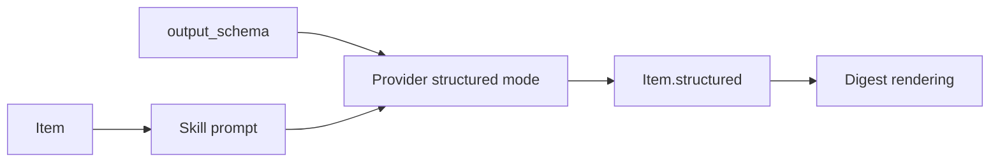

# Skills and structured extraction

Skills are named templates that ask an LLM to extract structured fields from items.

*Who reads this: users who want digests to carry facts, not just summaries.*

*This page is Explanation — read it to understand the model. For task-focused steps, see the [How-to guides](../how-to/index.md).*

A normal summary answers, "What is this item about?" A skill answers, "Which fields should this item contribute to a workflow?" That distinction is why skills exist. Security advisories need severity, affected packages, exploit status, and patch status. Deals need sale price, discount, expiration, and quality. Papers need contribution, method, limitations, and practical relevance. A paragraph can contain those facts, but downstream systems need a shape.

A skill is a reusable named extraction template. It has a `name`, a prompt, optionally a system prompt and LLM override, and an `output_schema`. The schema describes the JSON object the provider should return. During the `apply_skill` stage, glean renders the prompt for each item, asks the selected provider to extract data, stores the result on `Item.structured`, and may copy common summary-like fields into `Item.llm_summary` for existing renderers.

The same concept is implemented differently by each provider because structured output is provider-specific. Ollama receives the schema through `format=schema`. Anthropic receives a tool definition and forced tool choice, so the model must answer through that tool. OpenAI receives `response_format` with `json_schema` and strict schema mode. The user-facing concept is one skill; the provider layer translates it into the native mechanism.

Skills also participate in LLM dispatch. The precedence chain is **Skill LLM > Source LLM > Feed LLM > Defaults LLM**. A skill-level LLM is the strongest signal because some extraction tasks deserve a specific model regardless of where an item came from. If the skill has no LLM override, a source-level LLM can route items from noisy or curated sources differently. If neither exists, the feed LLM applies. Defaults cover everything else.

This makes skills composable. A `paper-digest` skill can be reused by an arXiv feed, a web-search feed, and a subreddit feed without copying prompts. A paid model can be reserved for one high-value skill while ranking and summarization stay on a cheaper local model. The skill is therefore both a semantic label and a cost-control boundary.
